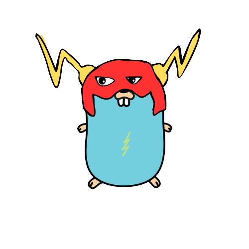

<p align="center">
  
</p>

# Central Profile Build Service
A POC to highlight what a central profile build service would look like.

Profile-guided optimization (PGO);
> also known as feedback-directed optimization (FDO), is a compiler optimization technique that feeds information (a profile) from representative runs of the application back into to the compiler for the next build of the application, which uses that information to make more informed optimization decisions. For example, the compiler may decide to more aggressively inline functions which the profile indicates are called frequently.

[more here](https://go.dev/doc/pgo)

## Problem
Containers typically host these services, completely disjoint from the build processes of the underlying service code. This separation provides a challenge for gathering runtime profiles and feeding them into the compiler. In many orginizations, services can typically be many and can be ephemeral in nature; perhaps due to frequent deployments, or genuine underlying instance instability (such as instance updates, using [spot instances](https://aws.amazon.com/ec2/spot/) etc...), building representative profiles in this environment is non-trivial. There's also the noted caveat with PGO where single binaries often serve multiple different "modes of operation" which introduces difficulty when curating mode representative profiles from production. 

## Proof of Concept;
Profiles are arbitrarily "tagged" and;

1. **We have a central server that handles the curation of runtime profiles**, allowing a central space for potential additional complications in the form of;
  - Using heuristics of a profile to determine it's suitability for use on the build side (minimum collection time etc...).
  - Handling the stitching together of various profiles of a service runtime (ensuring profiles stitched are equally sized etc...).
  - Publishing profiles of tags to respective repositories for reproducibility.

2. Participating **services call on a client library** in `main`;

```go
emit, _ := pcap.Capture("<service identifier>") // optionally handle setup err
defer func() {
  if err := emit(nil); err != nil {
    logger.WarnContext(ctx, "Failed to emit profile: "+err.Error())
  }
}() // optionally handle emit err
```

This spins up a runtime [pprof](https://pkg.go.dev/runtime/pprof) instance in the background, recording useful profile metrics that could be used to identify, for example, hot functions that could be benefited being compiled inline. We defer an emission of this profile to the server.

3. **A build style** that in its simplest form adds an additional step (`ENV SERVICE_TAG`), eg;

```Dockerfile
RUN curl default.pgo http://localhost:8080/profile/${SERVICE_TAG} || true
```

This line places the `default.pgo` file in purview of the compiler if a profile with this service tag exists without blocking anything already related to the build.

## What is demonstrated
A simple implementation of the idea here, we spin up this central server.

```bash
go run ./cmd/server/main.go
```

We then have an example service `./examples/main.go` that wants to benefit from this PGO, we hook up the client library, adding the `emit` firing to the callstack immediately. To bring this entire proof of concept into vision;

```bash
docker build --tag example -f ./examples/Dockerfile . && docker run --publish 8081:8081 example
```
